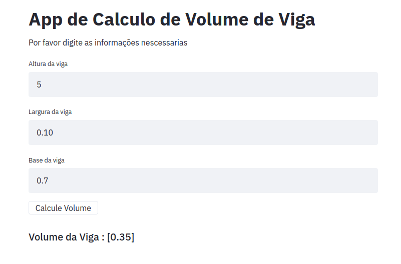

# SEMANA 3 CODIGO RODANDO COM STREAMLIT 

# Como Rodar Localmente 

$ source env/bin/activate 

(env) $ streamlit run app.py 

---

## Exemplos rodando no replit 

#### Classe cadastro de alunos 

https://repl.it/@juanengml/DesafioSemana-3-POO-Big-Data-e-AI

#### Classe e Encapsulamento Calculo de volume de viga

https://repl.it/@juanengml/DesafioSemana-3-POO-Big-Data-e-AI-parte-2

